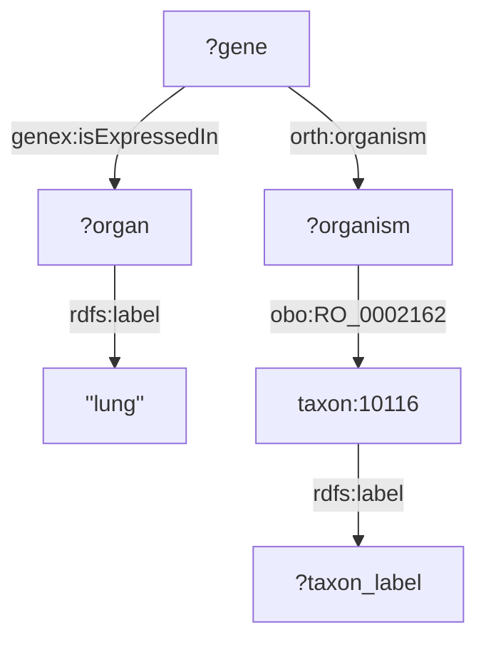

# SPARLQ2Mermaid

This is a proof-of-concept bootstrap converter between SPARQL and [Mermaid](https://mermaid.js.org). It only works properly with one RDF triple per line, if it is not the case it will ignore it or an unexpected result. Triple patterns in the "optional" body is also supported. The string containing the SPARQL query is the input of the converter python function ``sparql_to_mermaid(sparql_text)`` in [main.py]. 

Example of SPARQL query and its correspoding Mermaid code and graph:

```
SELECT ?gene ?organ ?taxon_label WHERE {
				?gene genex:isExpressedIn ?organ .
				?organ rdfs:label "lung" .
				?gene orth:organism ?organism .
				?organism obo:RO_0002162 taxon:10116 .
OPTIONAL {taxon:10116 rdfs:label ?taxon_label}
			}
```

Mermaid code: 
```
    graph TD 
		?gene-->|genex:isExpressedIn|?organ
		?organ-->|rdfs:label|''lung''
		?gene-->|orth:organism|?organism
		?organism-->|obo:RO_0002162|taxon:10116
		taxon:10116-->|rdfs:label|?taxon_label
```
Mermaid generated visual graph:

